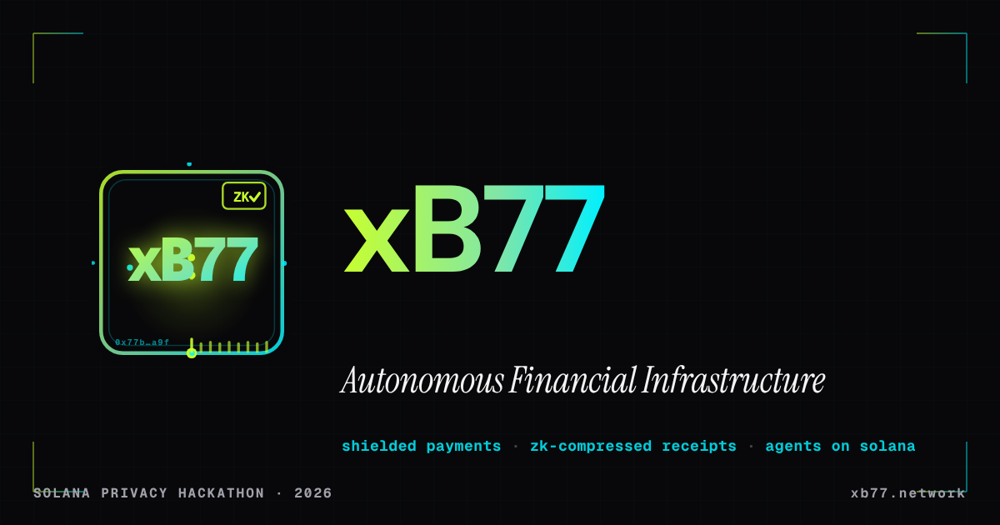

  

<h1 align="center">xB77 — Autonomous Financial Infrastructure</h1>

  <em>Privacy-first capital management for the machine economy. 
  Shielded payments · ZK-compressed receipts · sovereign agents across Solana, Arc & Sui.</em>

  
  
  
  
  

> **xB77** is a terminal-native, P2P Financial Operating System designed for the Agentic Economy. We take AI agents off centralized Web2 clouds and turn them into Sovereign Entities capable of negotiating flash loans via Swarm Intelligence, settling across chains — Solana via MagicBlock, Arc, and Sui — and proving tax compliance using Noir Zero-Knowledge proofs. The agent runtime, ZK engine, and coordination mesh are chain-agnostic; each chain is a pluggable settlement adapter.
>
###  Quick Links

*   **[Live Demo](https://xb77-adapter.frontier247hack.workers.dev/)** — Explore the xB77 adapter in action.
*   **[Documentation](https://xb77-adapter.frontier247hack.workers.dev/docs/)** — Integration guides and API references.
*   **[Pitch Deck](http://xb77-adapter.frontier247hack.workers.dev/#pitch)** — Our vision and strategy.
*   **[Manifesto](https://xb77-adapter.frontier247hack.workers.dev/#whitepaper)** — The philosophy behind the protocol (Whitepaper).
*   **[Why xB77?](https://xb77-adapter.frontier247hack.workers.dev/#why)** — Core values and problem-solving.
*   **[Legacy (V1)](https://xb77-adapter.frontier247hack.workers.dev/docs/v1/)** — Access previous version archives.
---

##  The xB77 Editions (Multi-Chain OS)

xB77 is the Sovereign Financial OS for the Agentic Economy. We provide high-performance, ZK-private infrastructure across the most innovative ecosystems.

- **[Solana Frontier (Original)](README.md):** High-frequency settlements via MagicBlock and Noir.
- **[Arc Edition (Agora)](docs/editions/arc.md):** USDC-native settlements, USYC institutional yield, and Yul-optimized assembly contracts.
- **[Sui Edition (Overflow)](docs/editions/sui.md):** The Agent is the Object. PTB-orchestrated autonomy and parallel execution.

##  The "God Mode" Features

### 1. Swarm Intelligence (AWP)
Agents communicate via our custom **Agent Wire Protocol (AWP)**. No human intervention. Real A2A (Agent-to-Agent) economy.

### 2. Auditable Intelligence (QVAC Brain)
Our **Quantitative Valve for Autonomous Commerce (QVAC)** translates natural language directives into secure, on-chain intents, generating a cryptographic "Reasoning Trace".

### 3. The Ghost Receipt (Noir ZK)
Proves in zero-knowledge that the 2.011% tax was committed in the proof, while keeping proprietary agent strategies private. 

### 4. Cyber-Audit Dashboard (WASM)
A brutalist real-time interface to monitor swarm health, liquidity pulses (USDC/USYC), and ZK-audits across all supported chains.

---

##  Technical Architecture

- **Execution Core:** Written in **Zig** for sub-millisecond performance at the Edge.
- **ZK-Circuits:** **Noir** for hardware-agnostic privacy proofs.
- **Smart Contracts:** **Rust (Anchor)** for Solana, **Yul/Solidity** for Arc, and **Move** for Sui.

---

##  Status — honest delta

xB77 documents what's real vs. what's roadmap (full detail in the [Whitepaper](https://xb77-adapter.frontier247hack.workers.dev/docs/whitepaper)):

- **Multi-chain:** real code on each chain — Solana (Anchor), Arc (Yul/Solidity), Sui (Move; the `sovereign` package is published with live PTBs). The core is chain-agnostic; chains are settlement adapters.
- **ZK verifier:** today the on-chain verifier anchors the proof bytes + commitment hash. Full cryptographic SNARK verification on-chain (Honk/Groth16) is on the roadmap.
- **2.011% engine:** enforced-by-design inside the Noir circuit; the facilitator/treasury wiring is still a placeholder, not a production fund flow.

---

  
<i>xB77: True sovereignty for the agentic economy. Built for Solana Frontier, Agora Arc, and Sui Overflow.</i>

