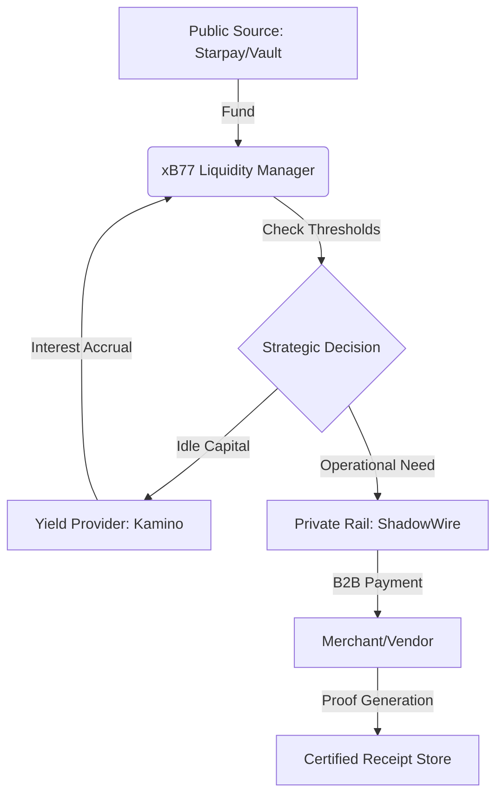
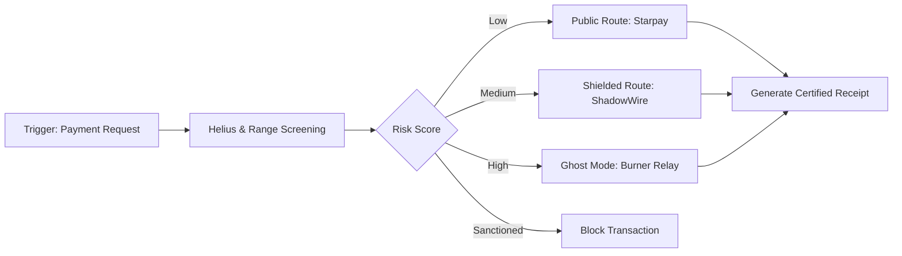
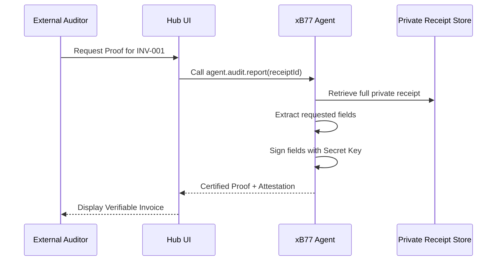
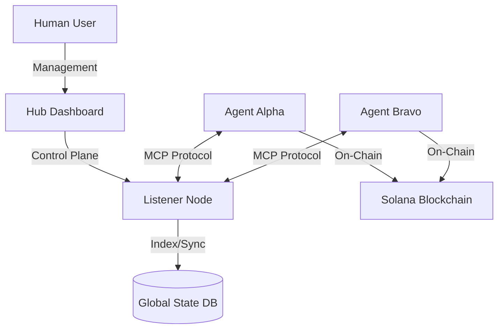

# xB77 System Architecture and Data Flow

## 1. High-Level Treasury Flow
This diagram illustrates how liquidity moves from public sources to shielded operations and yield optimization.

## 2. Autonomous Decision Loop (Strategy Engine)
The process an agent follows before executing any financial instruction.

## 3. Certified Selective Disclosure (Auditory)
How the agent proves its expenses to an external auditor without compromising global privacy.

## 4. Multi-Agent Ecosystem (MCP)
The relationship between humans, infrastructure, and autonomous agents.

