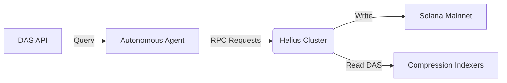

# Helius Integration

**Status:** 
**Role:** High-Performance RPC & Data Availability

Helius serves as the critical nervous system for xB77, providing the high-throughput RPC infrastructure required for high-frequency agent operations and the Digital Asset Standard (DAS) API for querying compressed state.

## Integration Architecture



## Key Capabilities

### 1. High-Performance RPC
Agents require near-instant transaction propagation to execute complex arbitrage or privacy operations. Helius provides the dedicated bandwidth necessary to prevent transaction drops during network congestion.

### 2. Digital Asset Standard (DAS)
xB77 heavily utilizes **State Compression** for storing receipt data and merchant logs. Helius's DAS API allows our agents to query this compressed data without maintaining expensive local indexers.

- **getAsset:** Retrieve specific receipt details.
- **getAssetsByOwner:** Reconstruct agent transaction history from compressed trees.

### 3. Webhooks (Smart Monitoring)
The infrastructure uses Helius Webhooks to listen for:
- Incoming Starpay funding events.
- Completion of ShadowWire privacy pools.
- Governance alerts requiring human intervention.

## Configuration
The integration is handled via the `HeliusConnection` adapter in the SDK:

```typescript
// SDK/src/infra/connection.ts
const connection = new HeliusConnection(process.env.HELIUS_API_KEY, {
    commitment: 'confirmed',
    wsEndpoint: process.env.HELIUS_WS
});
```
