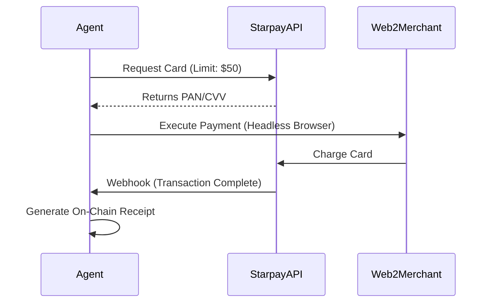

# Starpay Integration

**Status:** 
**Role:** Web2 Bridge & Fiat Rails

Starpay is the crucial link between the autonomous crypto-economy and the legacy fiat world. It allows xB77 Agents to interact with businesses that do not yet accept crypto, issuing virtual payment cards on demand.

## Core Features

### 1. Virtual Card Issuance
Agents can programmatically request a Virtual Visa/Mastercard via the `agent.starpay.issue_card` tool.
- **Dynamic Limits:** Cards can be funded with exact amounts for specific purchases.
- **Merchant Locking:** Cards can be locked to a specific Merchant ID to prevent fraud.

### 2. Corporate Funding Source
For enterprise agents, Starpay acts as the "Fiat Injection Point". Corporations can fund a Starpay account with USD, which the Agent then "pulls" into the crypto ecosystem (swapping to USDC/SOL) as needed for operations.

## The Hybrid Flow

## Documentation & API
The integration mocks the standard ISO 8583 message flows to ensure compatibility with real banking infrastructure in future iterations.