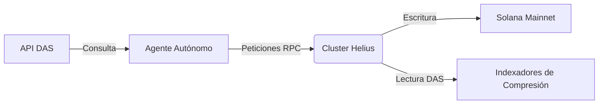

# Integración con Helius

**Estado:** 
**Rol:** RPC de Alto Rendimiento y Disponibilidad de Datos

Helius actúa como el sistema nervioso crítico de xB77, proporcionando la infraestructura RPC de alto rendimiento necesaria para operaciones de agentes de alta frecuencia y la API de Estándar de Activos Digitales (DAS) para consultar el estado comprimido.

## Arquitectura de Integración



## Capacidades Clave

### 1. RPC de Alto Rendimiento
Los agentes requieren una propagación de transacciones casi instantánea para ejecutar arbitrajes complejos u operaciones de privacidad. Helius proporciona el ancho de banda dedicado necesario para evitar la caída de transacciones durante la congestión de la red.

### 2. Estándar de Activos Digitales (DAS)
xB77 utiliza intensivamente **Compresión de Estado** para almacenar datos de recibos y registros de comerciantes. La API DAS de Helius permite a nuestros agentes consultar estos datos comprimidos sin mantener costosos indexadores locales.

- **getAsset:** Recuperar detalles específicos de un recibo.
- **getAssetsByOwner:** Reconstruir el historial de transacciones del agente desde árboles comprimidos.

### 3. Webhooks (Monitoreo Inteligente)
La infraestructura utiliza Webhooks de Helius para escuchar:
- Eventos entrantes de financiamiento de Starpay.
- Finalización de pools de privacidad de ShadowWire.
- Alertas de gobernanza que requieren intervención humana.

## Configuración
La integración se maneja a través del adaptador `HeliusConnection` en el SDK:

```typescript
// SDK/src/infra/connection.ts
const connection = new HeliusConnection(process.env.HELIUS_API_KEY, {
    commitment: 'confirmed',
    wsEndpoint: process.env.HELIUS_WS
});
```
