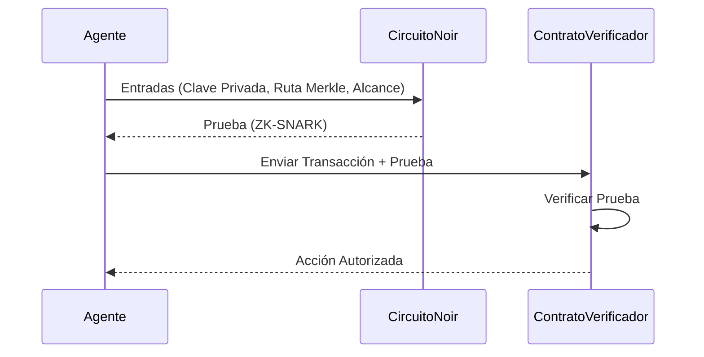

# Integración con Noir

**Estado:** 
**Rol:** Identidad ZK e Insignias de Agente

Noir (por Aztec) impulsa la capa de identidad criptográfica de xB77. Permite las "Agent Badges" (Insignias de Agente)—Pruebas de Conocimiento Cero que permiten a los agentes demostrar su autorización y estado de cumplimiento sin revelar sus claves privadas o historial operativo subyacente.

## El Concepto de Agent Badge

Una **Agent Badge** es un ZK-SNARK generado por Noir que prueba:
1.  **Propiedad:** "Controlo la clave privada asociada con este ID público de agente."
2.  **Cumplimiento:** "No estoy en ninguna lista negra (Range Protocol)."
3.  **Autorización:** "He sido autorizado por la DAO para gastar hasta una cantidad X."

## Flujo de Integración



## Lógica del Circuito
El circuito principal `circuits/agent_badge/src/main.nr` valida la afirmación del agente contra un Árbol Merkle de entidades autorizadas.

```rust
// Lógica Noir Simplificada
fn main(
    root: pub Field, 
    private_key: Field, 
    merkle_path: [Field; DEPTH]
) {
    let computed_root = compute_root(private_key, merkle_path);
    assert(root == computed_root);
}
```

## ¿Por qué Noir?
- **Probas del Lado del Cliente:** Los agentes generan pruebas localmente (en el navegador o entorno Node.js), asegurando que los secretos nunca salgan de su control.
- **Sintaxis tipo Rust:** Lo hace accesible para nuestro equipo de ingeniería para escribir lógica compleja (como "límites de gasto" o "bloqueos de tiempo") directamente en el circuito ZK.
