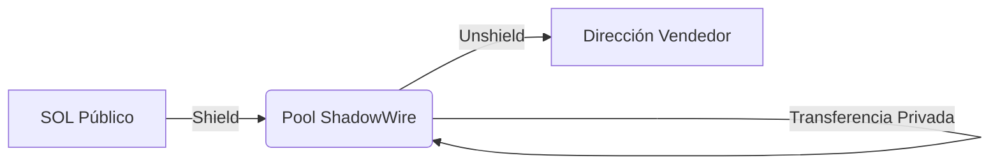

# Integración con ShadowWire

**Estado:** 
**Rol:** Riel de Pago Protegido

ShadowWire es el riel de pago dedicado construido sobre Light Protocol. Maneja el movimiento de valor (SOL/Tokens SPL) de manera completamente protegida, rompiendo el vínculo entre el remitente y el destinatario.

## Cómo Funciona

ShadowWire utiliza un **modelo tipo UTXO** (Unspent Transaction Output) similar a Zcash, pero implementado en la capa de alta velocidad de Solana.

1.  **Shield (Depósito):** Un agente deposita SOL público en el Pool de ShadowWire. Se crea un UTXO privado.
2.  **Transfer (Privado):** El agente gasta el UTXO para crear un nuevo UTXO para el destinatario. Esta transacción NO revela información sobre el monto o las partes involucradas en el libro mayor público.
3.  **Unshield (Retiro):** El destinatario puede retirar fondos de vuelta a una dirección pública si es necesario (por ejemplo, para pagar gas o interactuar con DeFi heredado).

## Privacidad vs Transparencia
ShadowWire permite a los agentes operar en "Modo Sigiloso" para operaciones estratégicas (ej. construir una posición sin alertar al mercado) mientras mantiene la capacidad de revelar selectivamente el historial de transacciones vía **Pruebas Noir** para auditoría.

