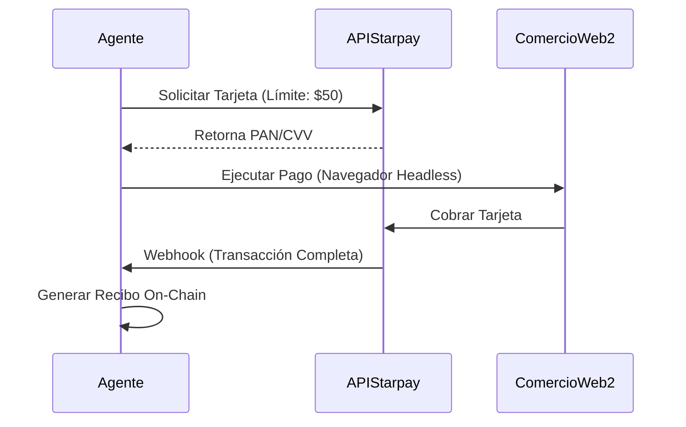

# Integración con Starpay

**Estado:** 
**Rol:** Puente Web2 y Rieles Fiat

Starpay es el enlace crucial entre la criptoeconomía autónoma y el mundo fiat heredado. Permite a los Agentes xB77 interactuar con negocios que aún no aceptan cripto, emitiendo tarjetas de pago virtuales bajo demanda.

## Características Principales

### 1. Emisión de Tarjetas Virtuales
Los agentes pueden solicitar programáticamente una Visa/Mastercard Virtual a través de la herramienta `agent.starpay.issue_card`.
- **Límites Dinámicos:** Las tarjetas pueden ser financiadas con montos exactos para compras específicas.
- **Bloqueo de Comerciante:** Las tarjetas pueden bloquearse para un Merchant ID específico para prevenir fraude.

### 2. Fuente de Financiamiento Corporativo
Para agentes empresariales, Starpay actúa como el "Punto de Inyección Fiat". Las corporaciones pueden financiar una cuenta Starpay con USD, que el Agente luego "jala" al ecosistema cripto (intercambiando a USDC/SOL) según sea necesario para operaciones.

## El Flujo Híbrido

## Documentación y API
La integración simula los flujos de mensajes estándar ISO 8583 para asegurar compatibilidad con infraestructura bancaria real en iteraciones futuras.
