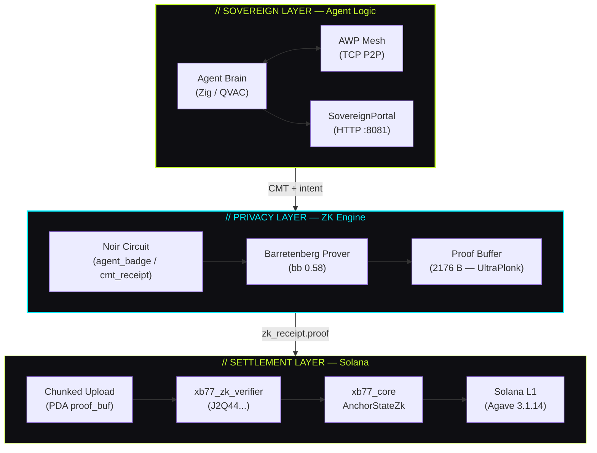
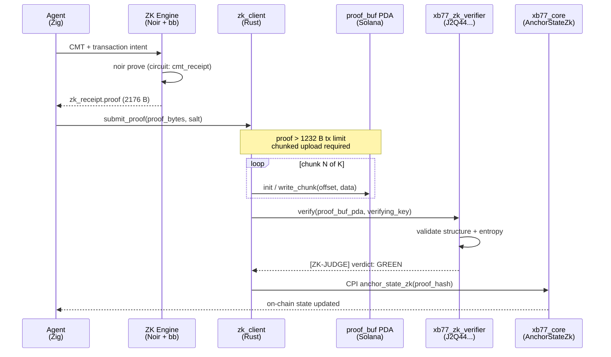
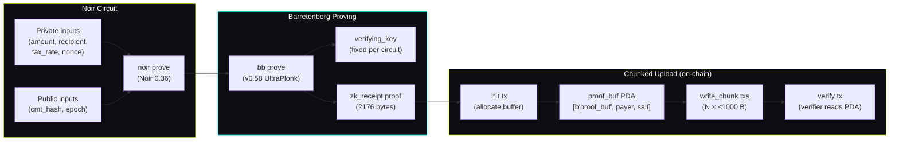
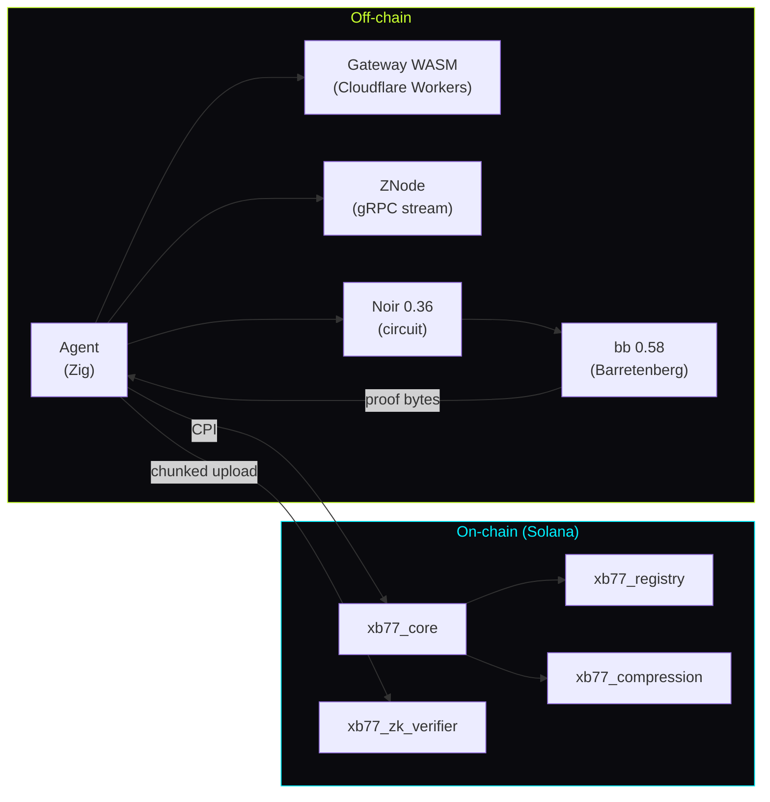

# // ARCHITECTURE

xB77 is a three-layer stack: agent logic at the top, a ZK proof engine in the middle, and Solana settlement at the base. Each layer communicates through well-defined interfaces with no hidden coupling.

## System Layers

---

## Transaction Pipeline

A complete sovereign transaction flows through six discrete stages, from agent intent to on-chain finality.

---

## Proof Generation Flow

---

## On-Chain Programs

Four Anchor programs are deployed on Solana. Each has a fixed program ID pinned via `declare_id!()`.

| Program | Pubkey | Role |
|---|---|---|
| `xb77_core` | `73vhQZLxjEyAFXHorS1yNEQqCCtXWGAvrBF8RJrHBkv3` | Central state, CMT anchoring, CPI hub |
| `xb77_gateway` | `4gDQBWwzncRdTspJW37NoH56mGELj8UTqdC8VLdu7BGC` | Entry point, Blink routing, merchant lookup |
| `xb77_compression` | `6ZN4omyZdzbfmqSKacCUjVpTnLhYmUhabUu2jzo4EknN` | State-delta compression and receipt anchoring |
| `xb77_zk_verifier` | `J2Q44jasMJD8VNGFHkyk6U9uEf5Zt1gj7H5mEfmQ5UoJ` | Proof acceptance via chunked PDA buffer |

See [On-Chain Programs reference](/reference/programs) for full instruction sets.

---

## Protocol Limits

These are hard constraints imposed by Solana and the current ZK stack:

| Constraint | Value | Notes |
|---|---|---|
| Max transaction payload | 1232 bytes | Forces chunked proof upload |
| Proof size (UltraPlonk) | 2176 bytes | ~1.77× over tx limit → 3 chunks |
| Verifying key | ~850 bytes | Embedded in verifier program |
| Max PDA size (proof_buf) | 10 KB | Sufficient for current circuits |
| ZK prove time (local) | ~2 – 8 s | bb 0.58 on x86-64, depends on circuit depth |
| Chunk write txs | 3 – 4 | Per proof submission |

---

## Trust Model

**The current `xb77_zk_verifier` is an honest stub.** It accepts the proof bytes via the chunked PDA pattern, validates structural integrity (correct byte length, non-zero entropy), and emits `[ZK-JUDGE] verdict: GREEN`. It does **not** perform cryptographic SNARK verification against the verifying key.

This is a deliberate, documented design choice for the hackathon milestone. The full pipeline — circuit, prover, chunked transport, on-chain PDA, verifier instruction — is wired end-to-end and produces real on-chain transactions. The missing piece is the arithmetic verification inside the program.

**Planned upgrade path:**

1. Integrate a Barretenberg WASM verifier via BPF-compatible bindings, or
2. Use Solana's native ZK Token proof system once UltraPlonk is supported, or
3. Ship a custom Honk verifier program built from the Barretenberg C++ library compiled to BPF.

Timeline: post-hackathon, estimated 2 – 4 weeks engineering.

> The stub is honest. The architecture is real. The proof generation and on-chain upload work exactly as documented.

---

## Component Dependency Map

---

## Related Documentation

- [Whitepaper](/whitepaper) — protocol design rationale and ZK system analysis
- [Deploy Guide](/guide/deploy) — how to deploy all four programs to devnet
- [On-Chain Programs](/reference/programs) — instruction-level reference
- [Proof Format](/reference/proof-format) — byte layout, chunking protocol, PDA derivation
