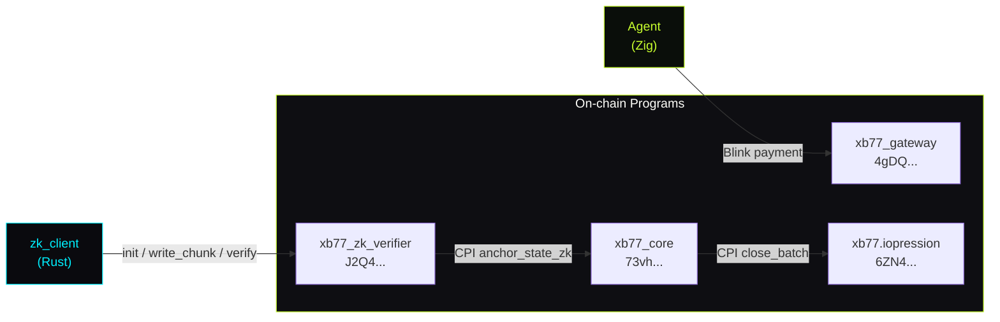

# // ON-CHAIN PROGRAMS

xB77 deploys four Anchor programs on Solana. All program IDs are pinned via `declare_id!()` in each program's `lib.rs` and are bound to keypairs in `onchain/programs/<name>/target/deploy/<name>-keypair.json`.

> The program IDs below are the devnet addresses from the Frontier hackathon deployment. Mainnet IDs will differ.

---

## Program Registry

| Program | Address | Status |
|---|---|---|
| `xb77_core` | `73vhQZLxjEyAFXHorS1yNEQqCCtXWGAvrBF8RJrHBkv3` | Deployed, active |
| `xb77_gateway` | `4gDQBWwzncRdTspJW37NoH56mGELj8UTqdC8VLdu7BGC` | Deployed, active |
| `xb77.iopression` | `6ZN4omyZdzbfmqSKacCUjVpTnLhYmUhabUu2jzo4EknN` | Deployed, active |
| `xb77_zk_verifier` | `J2Q44jasMJD8VNGFHkyk6U9uEf5Zt1gj7H5mEfmQ5UoJ` | Deployed, active (honest stub) |

Verify on-chain status:

```bash
solana program show 73vhQZLxjEyAFXHorS1yNEQqCCtXWGAvrBF8RJrHBkv3
solana program show 4gDQBWwzncRdTspJW37NoH56mGELj8UTqdC8VLdu7BGC
solana program show 6ZN4omyZdzbfmqSKacCUjVpTnLhYmUhabUu2jzo4EknN
solana program show J2Q44jasMJD8VNGFHkyk6U9uEf5Zt1gj7H5mEfmQ5UoJ
```

---

## xb77_core

**Address:** `73vhQZLxjEyAFXHorS1yNEQqCCtXWGAvrBF8RJrHBkv3`

Central state program. Anchors CMT roots, holds `AnchorStateZk`, and acts as CPI hub for other programs.

### Instructions

| Instruction | Accounts | Args | Description |
|---|---|---|---|
| `initialize` | `state` (init), `payer` (signer), `system_program` | — | Creates the global `AnchorStateZk` account |
| `anchor_cmt` | `state`, `payer` (signer) | `root: [u8; 32]`, `epoch: u64` | Anchors a CMT root with epoch number |
| `anchor_state_zk` | `state`, `payer` (signer), `verifier_result` | `proof_hash: [u8; 32]` | Records a verified proof hash; called via CPI from verifier |

### `AnchorStateZk` Account Layout

```
discriminator:   [u8; 8]     — Anchor discriminator
authority:       Pubkey       — Deploy authority
cmt_root:        [u8; 32]    — Latest anchored CMT root
proof_hash:      [u8; 32]    — Latest verified proof hash
epoch:           u64          — Epoch counter
total_anchors:   u64          — Lifetime anchor count
bump:            u8           — PDA bump seed
```

---

## xb77_gateway

**Address:** `4gDQBWwzncRdTspJW37NoH56mGELj8UTqdC8VLdu7BGC`

Payment entry point. Routes Solana Actions (Blinks) to merchant accounts and validates payment amounts.

### Instructions

| Instruction | Accounts | Args | Description |
|---|---|---|---|
| `register_blink` | `blink_account` (init), `merchant` (signer), `system_program` | `handle: String`, `price_lamports: u64` | Registers a merchant Blink endpoint |
| `process_payment` | `blink_account`, `payer` (signer), `merchant`, `system_program` | `amount: u64` | Processes a payment and emits a receipt |
| `update_metadata` | `blink_account`, `merchant` (signer) | `name: String`, `description: String` | Updates Blink metadata |

### Blink Account Layout

```
discriminator:     [u8; 8]
handle:            String      — e.g. "neotokyo"
merchant:          Pubkey
price_lamports:    u64
name:              String
description:       String
total_payments:    u64
bump:              u8
```

---

## xb77.iopression

**Address:** `6ZN4omyZdzbfmqSKacCUjVpTnLhYmUhabUu2jzo4EknN`

State-delta compression. Stores compressed transaction batches and receipt anchors.

### Instructions

| Instruction | Accounts | Args | Description |
|---|---|---|---|
| `init_batch` | `batch` (init), `authority` (signer), `system_program` | `batch_id: [u8; 16]` | Allocates a new batch account |
| `append_delta` | `batch`, `authority` (signer) | `delta: Vec<u8>`, `leaf_hash: [u8; 32]` | Appends a compressed state delta |
| `close_batch` | `batch`, `authority` (signer), `core_state` | `final_root: [u8; 32]` | Closes batch, CPIs anchor_cmt to xb77_core |

### Batch Account Layout

```
discriminator:   [u8; 8]
batch_id:        [u8; 16]
authority:       Pubkey
leaf_count:      u32
root:            [u8; 32]    — Merkle root (updated on close)
deltas_len:      u32
deltas:          Vec<u8>     — RLP-encoded compressed state deltas
bump:            u8
```

---

## xb77_zk_verifier

**Address:** `J2Q44jasMJD8VNGFHkyk6U9uEf5Zt1gj7H5mEfmQ5UoJ`

Proof acceptance program. Receives the assembled proof buffer from a PDA, validates it, and emits a verdict. **Currently an honest stub** — validates structure and entropy, does not perform cryptographic SNARK verification.

See [Proof Format](/reference/proof-format) for the full PDA buffer protocol.

### Instructions

| Instruction | Accounts | Args | Description |
|---|---|---|---|
| `init_proof_buf` | `proof_buf` (init), `payer` (signer), `system_program` | `salt: [u8; 8]`, `expected_len: u32` | Allocates the proof buffer PDA |
| `write_chunk` | `proof_buf`, `payer` (signer) | `offset: u32`, `data: Vec<u8>` | Writes a chunk of proof bytes into the buffer |
| `verify` | `proof_buf`, `payer` (signer) | — | Reads the assembled buffer, validates, emits verdict |

### PDA Derivation

```
seeds = [b"proof_buf", payer.key().as_ref(), salt.as_ref()]
program = J2Q44jasMJD8VNGFHkyk6U9uEf5Zt1gj7H5mEfmQ5UoJ
```

### Verdict Emission

On success, the `verify` instruction emits the following log message (readable via Solana event log):

```
[ZK-JUDGE] verdict: GREEN
```

On structural failure:

```
[ZK-JUDGE] verdict: RED — invalid proof structure
```

### Honest Stub Behavior

The current verifier accepts any buffer that:
1. Is exactly 2176 bytes
2. Has non-zero entropy in the first 64 bytes (rejects zero-padded buffers)
3. Passes a basic length-prefix check against the expected proof format

It does **not** verify the UltraPlonk SNARK against the verifying key. This is documented and planned for upgrade post-hackathon. See [Whitepaper §6](/whitepaper#6-threat-model) and [Whitepaper §8](/whitepaper#8-roadmap-from-stub-to-full-verifier).

---

## Program Interaction Map



---

## Upgrade Authority

All four programs share the same upgrade authority: the deploy wallet at `~/.config/solana/id.json`. This is a single key. If lost, programs cannot be upgraded. If leaked, an adversary can replace programs.

See [Deploy Guide — Operational Hygiene](/guide/deploy#operational-hygiene) for backup requirements.

---

## Related Documentation

- [Proof Format](/reference/proof-format) — PDA buffer protocol, chunk sizes, proof byte layout
- [Architecture](/architecture) — how the programs fit into the full pipeline
- [Deploy Guide](/guide/deploy) — how to deploy and verify programs on devnet
