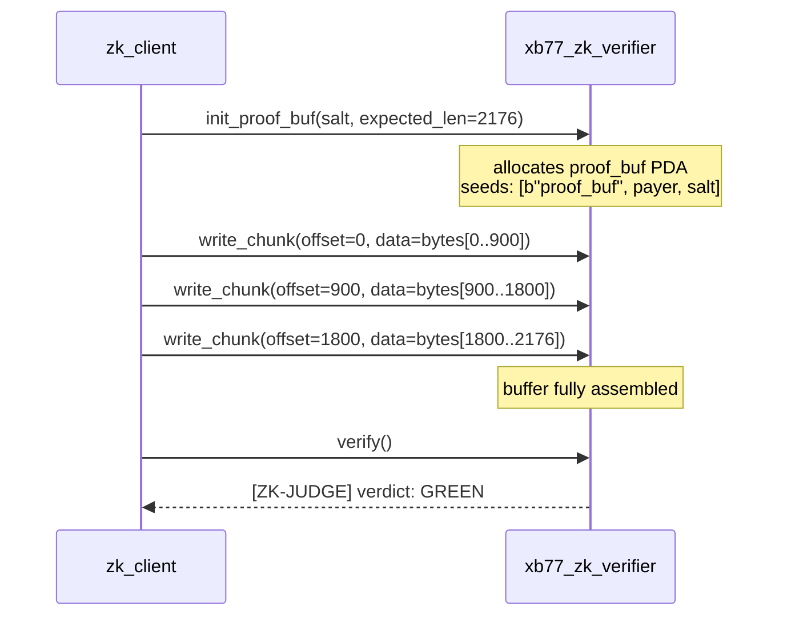

# // PROOF FORMAT

The xB77 ZK proof is a UltraPlonk proof generated by Barretenberg 0.58 from a Noir 0.36 circuit. This document covers the binary format, the on-chain chunked transport protocol, and the PDA derivation scheme.

---

## Proof Binary Layout

The proof file (`zk_receipt.proof`) is a flat binary blob of **2176 bytes**. The layout is defined by Barretenberg's UltraPlonk serialization format.

```
Offset    Size    Field
------    ----    -----
0         4       proof_size (u32 LE) — always 2172 for this circuit
4         32      circuit_size commitment (G1 affine point x)
36        32      circuit_size commitment (G1 affine point y)
68        32      W_1 wire commitment x
100       32      W_1 wire commitment y
132       32      W_2 wire commitment x
164       32      W_2 wire commitment y
196       32      W_3 wire commitment x
228       32      W_3 wire commitment y
...                (additional wire and permutation commitments)
...                (evaluations at zeta)
...                (opening proof points)
2140      32      final aggregation point x
2172      4       padding / alignment
```

> The exact field breakdown varies with circuit depth. The 2176-byte total is fixed for the `cmt_receipt` circuit compiled with Noir 0.36 targeting UltraPlonk. If you recompile the circuit with different parameters, the size may change — update the verifier's `expected_len` argument accordingly.

---

## Verifying Key

The verifying key is circuit-specific and fixed for a given compiled circuit. It is embedded in the `xb77_zk_verifier` program at compile time.

| Property | Value |
|---|---|
| Size | ~850 bytes |
| Format | Barretenberg serialized VK |
| Circuit | `circuits/cmt_receipt/` |
| Recompile required | Yes, on any circuit change |

To extract the verifying key from a fresh Noir build:

```bash
cd circuits/cmt_receipt
nargo prove
# generates proof + verifying_key in target/
ls target/
# cmt_receipt.proof  cmt_receipt.vk
```

---

## Chunked Transport Protocol

Because the proof (2176 B) exceeds Solana's 1232-byte transaction payload limit, it is uploaded in chunks via a PDA buffer.

### Overview



### Chunk Sizing

| Constraint | Value |
|---|---|
| Max tx payload | 1232 B |
| Overhead (accounts, sig, header) | ~200 – 300 B |
| Safe chunk data size | ≤ 900 B |
| Chunks required for 2176 B proof | 3 (typical) |

In practice, the `zk_client` uses chunks of up to 900 bytes of proof data per transaction. The exact number of chunks depends on available headroom after accounting for the PDA account metas.

### PDA Derivation

```rust
// Rust (Anchor)
let (proof_buf_pda, bump) = Pubkey::find_program_address(
    &[
        b"proof_buf",
        payer.key().as_ref(),
        salt.as_ref(),   // [u8; 8], caller-chosen nonce
    ],
    &program_id,  // J2Q44jasMJD8VNGFHkyk6U9uEf5Zt1gj7H5mEfmQ5UoJ
);
```

```zig
// Zig (core/chain/solana.zig — PDA helper)
const seeds = .{
    "proof_buf",
    payer_pubkey,
    salt,
};
const pda = try solana.findProgramAddress(seeds, VERIFIER_PROGRAM_ID);
```

### Salt Selection

The `salt` is a caller-chosen 8-byte nonce. Its purpose is to allow the same payer to maintain multiple concurrent proof buffers. Recommended values:

- Sequential counter (u64 LE) — simplest, ensures uniqueness per session
- Timestamp (u64 LE) — provides rough deduplication across restarts
- Random bytes — maximum uniqueness, no ordering assumption

---

## Proof Buffer Account Layout

After `init_proof_buf`, the PDA holds:

```
discriminator:   [u8; 8]     — Anchor discriminator
payer:           Pubkey
salt:            [u8; 8]
expected_len:    u32          — 2176
filled_len:      u32          — grows with each write_chunk
data:            [u8; 10240] — fixed-size backing store (10 KB max)
bump:            u8
```

After each `write_chunk`, `filled_len` increments by the chunk size. The `verify` instruction fires only when `filled_len == expected_len`.

---

## Generating a Proof

### Prerequisites

- Noir 0.36: `nargo --version`
- Barretenberg 0.58: `bb --version`

### Full Proof Generation

```bash
# 1. Navigate to the circuit directory
cd circuits/cmt_receipt

# 2. Set the Prover.toml inputs
cat Prover.toml
# amount = "50000000"
# recipient_hash = "0xabc123..."
# tax_rate = "2011"        # 201.1 bps
# nonce = "0xdeadbeef..."
# epoch = "42"
# cmt_root = "0x..."       # public input

# 3. Prove
nargo prove

# 4. Output
ls target/
# cmt_receipt.proof    (binary, 2176 B)
# cmt_receipt.vk       (binary, ~850 B)

# 5. Verify locally (optional sanity check)
bb verify -p target/cmt_receipt.proof -k target/cmt_receipt.vk
# Proof verified successfully
```

### Uploading On-Chain

The Rust `zk_client` handles the chunked upload automatically:

```rust
// onchain/clients/zk_client/src/main.rs
let proof_bytes = std::fs::read("circuits/cmt_receipt/target/cmt_receipt.proof")?;
let salt: [u8; 8] = rand::random();

zk_client::submit_proof(
    &rpc_client,
    &payer_keypair,
    &proof_bytes,
    &salt,
    VERIFIER_PROGRAM_ID,
).await?;
// Emits: [ZK-JUDGE] verdict: GREEN
```

A Zig port of this client is planned (`core/chain/solana.zig` provides the base). Estimated effort: ~2 hours given the existing Solana client infrastructure.

---

## End-to-End Test

The `zk-upload-e2e` binary (available as a Release artifact) exercises the full pipeline:

```bash
# Download from Release
gh release download v0.2.2-deluxe --pattern 'zk-upload-e2e'
chmod +x zk-upload-e2e

# Run against devnet
./zk-upload-e2e --rpc https://api.devnet.solana.com

# Expected output
[ZK] Generating proof...
[ZK] Proof generated: 2176 bytes
[ZK] Uploading in 3 chunks...
[ZK] Chunk 1/3: tx 3xNp...
[ZK] Chunk 2/3: tx 7mKq...
[ZK] Chunk 3/3: tx 9wLr...
[ZK] Verifying...
[ZK-JUDGE] verdict: GREEN
[ZK] Done. Proof anchored on-chain.
```

---

## Related Documentation

- [On-Chain Programs](/reference/programs) — `xb77_zk_verifier` instruction reference
- [Architecture](/architecture) — proof flow diagram and trust model
- [Whitepaper §4](/whitepaper#4-core-primitives) — ZK Engine design rationale
- [Glossary](/reference/glossary) — definitions for UltraPlonk, PDA, CMT, etc.
