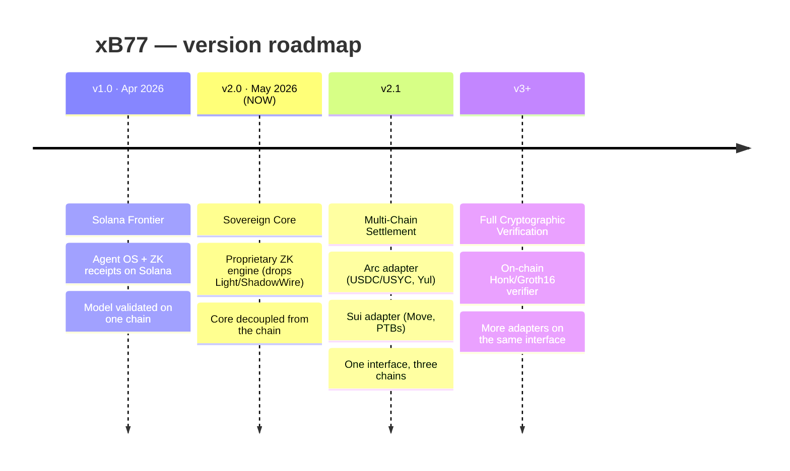

# // ROADMAP

The evolution of xB77 as a product. This is the **version roadmap** — for the
cryptographic maturity of the on-chain verifier specifically, see
[Whitepaper §8](/whitepaper#8-roadmap-verifier-maturity).

> **Honesty key:** `[done]` shipped and exercised · `[wired]` built but stubbed /
> not yet end-to-end · `[roadmap]` designed, not built.

---

## The throughline

xB77 was never "a Solana app." The core — agent runtime (Zig), ZK proof engine
(Noir), the AWP coordination mesh, the QVAC brain, and the 2.011% engine — is
**chain-agnostic**. Each chain is a **settlement adapter** behind a common interface.

That decoupling is the spine of this roadmap: every chain we add is the *same core*
speaking to a *new adapter*, not a rewrite.

---

## v1.0 — Solana Frontier `Apr 2026`

The thesis, proven on a single chain.

- `[done]` Agent runtime + AWP mesh
- `[done]` ZK receipts (Noir) anchored on Solana
- `[done]` Blink / Solana Actions payment UX

## v2.0 — Sovereign Core `May 2026` · **CURRENT**

The pivot that makes everything else possible: the core stops depending on the chain.

- `[done]` Proprietary ZK engine (removed Light Protocol / ShadowWire / Privacy Cash)
- `[done]` Chain-agnostic core: agent OS, AWP, QVAC brain, 2.011% engine
- `[done]` Settlement-adapter interface (Solana = reference implementation)
- `[wired]` On-chain ZK verifier — structural stub today; anchors proof bytes +
  commitment hash, does **not** yet verify the SNARK (see [Whitepaper §8](/whitepaper#8-roadmap-verifier-maturity))

> This decoupling is *why* multi-chain is a near-term step and not a rewrite.

## v2.1 — Multi-Chain Settlement

The same sovereign core, settling on three chains through one adapter interface.

- `[wired]` **Arc Edition (Agora):** USDC-native settlement, USYC institutional yield,
  Yul-optimized `Settlement.sol` (`forge build` green)
- `[wired]` **Sui Edition (Overflow):** `sovereign` Move package published, PTB-orchestrated
  bridge — "the agent is the object"
- `[roadmap]` Unified cross-chain agent flows behind the shared adapter API
- `[roadmap]` `suiPulse` / `arcPulse` live telemetry feeds in the network dashboard

## v3+ — Full Cryptographic Verification

Closing the honest gap, then widening the reach.

- `[roadmap]` On-chain cryptographic verification — Honk-in-BPF or Groth16 migration
  (candidate paths in [Whitepaper §8](/whitepaper#8-roadmap-verifier-maturity))
- `[roadmap]` Additional settlement adapters on the same interface
- `[roadmap]` Live 2.011% facilitator economics (today the facilitator address is a placeholder)

---

*[Architecture →](/architecture)* · *[Whitepaper →](/whitepaper)* · *[Changelog →](/changelog)*
