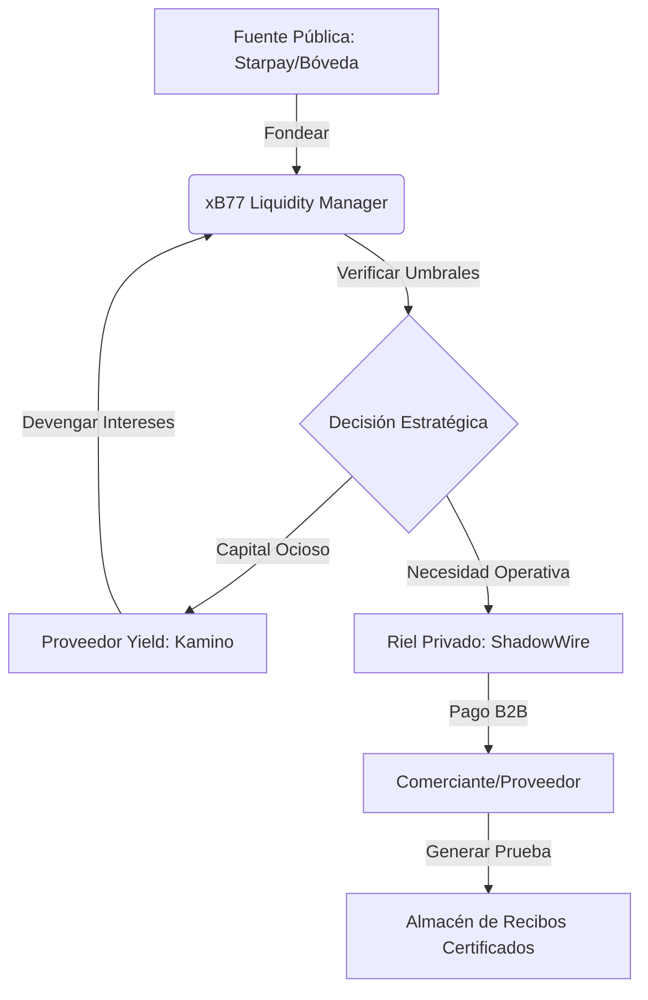
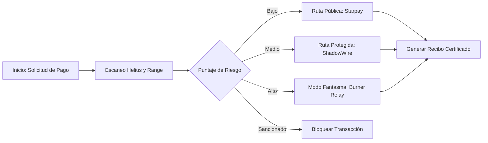
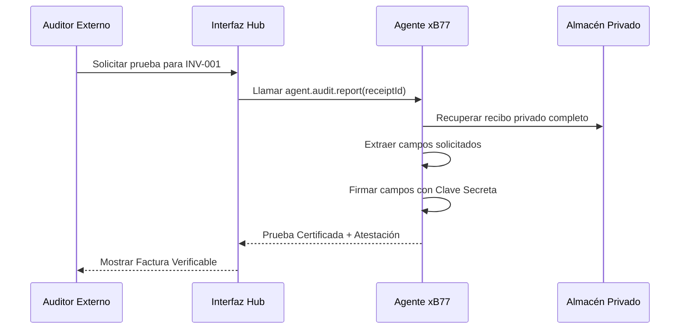

# Arquitectura del Sistema y Flujo de Datos xB77

## 1. Flujo de Tesorería de Alto Nivel
Este diagrama ilustra cómo se mueve la liquidez desde fuentes públicas hacia operaciones protegidas y optimización de rendimiento.

## 2. Bucle de Decisión Autónoma (Motor de Estrategia)
El proceso que sigue un agente antes de ejecutar cualquier instrucción financiera.

## 3. Revelación Selectiva Certificada (Auditoría)
Cómo el agente prueba sus gastos a un auditor externo sin comprometer la privacidad global.

