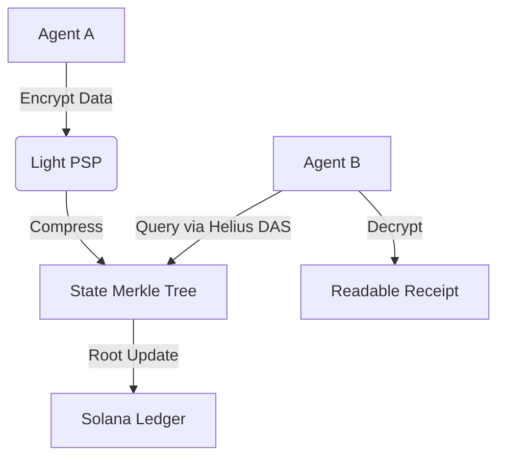

# Light Protocol Integration

**Status:** 
**Role:** Private State & Compression

Light Protocol is the backbone of xB77's privacy and scalability. It provides the **Private State Machine (PSP)** on Solana, enabling shielded balances and compressed storage for high-volume data like receipts and merchant catalogs.

## Use Cases

### 1. Encrypted Receipts (M2M)
Every transaction between agents generates a "Receipt". Storing these as standard Solana accounts would be prohibitively expensive and public. Light Protocol allows us to store them as **Compressed State**, encrypted with the recipient's viewing key.

- **Cost:** ~0.000005 SOL per receipt (vs ~0.002 SOL for rent-exempt accounts).
- **Privacy:** Only the holder of the Viewing Key can decrypt the receipt details.

### 2. Merchant Catalogs
Merchants list thousands of items. Light Protocol enables **Compressed NFTs** or data structures to represent these catalogs on-chain without bloating the state, making the "Machine Economy" economically viable.

## Architecture



## Implementation
The `xb77_receipts` program interacts with Light's CPI to mint compressed state.

```rust
// onchain/programs/xb77_receipts/src/lib.rs
pub fn emit_receipt(ctx: Context<EmitReceipt>, data: ReceiptData) -> Result<()> {
    light_cpi::create_compressed_account(
        ctx.accounts.light_program.to_account_info(),
        &data.encrypt(ctx.accounts.recipient.key),
    )?;
    Ok(())
}
```
