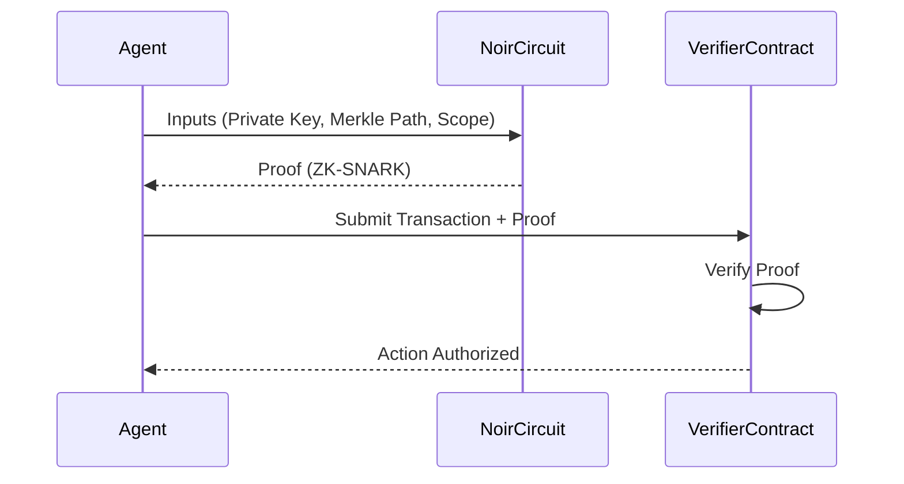

# Noir Integration

**Status:** 
**Role:** ZK-Identity & Agent Badges

Noir (by Aztec) powers the cryptographic identity layer of xB77. It enables "Agent Badges"—Zero-Knowledge Proofs that allow agents to prove their authorization and compliance status without revealing their private keys or underlying operational history.

## The Agent Badge Concept

An **Agent Badge** is a ZK-SNARK generated by Noir that proves:
1.  **Ownership:** "I control the private key associated with this public agent ID."
2.  **Compliance:** "I am not on any blacklist (Range Protocol)."
3.  **Authorization:** "I have been authorized by the DAO to spend up to X amount."

## Integration Flow



## Circuit Logic
The core circuit `circuits/agent_badge/src/main.nr` validates the agent's claim against a Merkle Tree of authorized entities.

```rust
// Simplified Noir Logic
fn main(
    root: pub Field, 
    private_key: Field, 
    merkle_path: [Field; DEPTH]
) {
    let computed_root = compute_root(private_key, merkle_path);
    assert(root == computed_root);
}
```

## Why Noir?
- **Client-Side Proving:** Agents generate proofs locally (in the browser or Node.js environment), ensuring secrets never leave their control.
- **Rust-Like Syntax:** Makes it accessible for our engineering team to write complex logic (like "spending limits" or "time-locks") directly into the ZK circuit.
