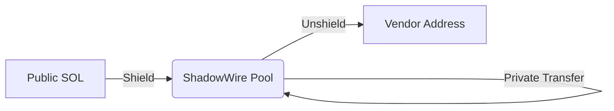

# ShadowWire Integration

**Status:** 
**Role:** Shielded Payment Rail

ShadowWire is the dedicated payment rail built on top of Light Protocol. It handles the movement of value (SOL/SPL Tokens) in a completely shielded manner, breaking the link between the sender and the recipient.

## How it Works

ShadowWire uses a **UTXO-like model** (Unspent Transaction Output) similar to Zcash, but implemented on Solana's high-speed layer.

1.  **Shield (Deposit):** An agent deposits public SOL into the ShadowWire Pool. A private UTXO is created.
2.  **Transfer (Private):** The agent spends the UTXO to create a new UTXO for the recipient. This transaction reveals NO information about the amount or the parties involved on the public ledger.
3.  **Unshield (Withdraw):** The recipient can withdraw funds back to a public address if needed (e.g., to pay for gas or interact with legacy DeFi).

## Privacy vs Transparency
ShadowWire allows agents to operate in "Stealth Mode" for strategic operations (e.g., building a position without alerting the market) while maintaining the ability to selectively disclose transaction history via **Noir Proofs** for auditing.

