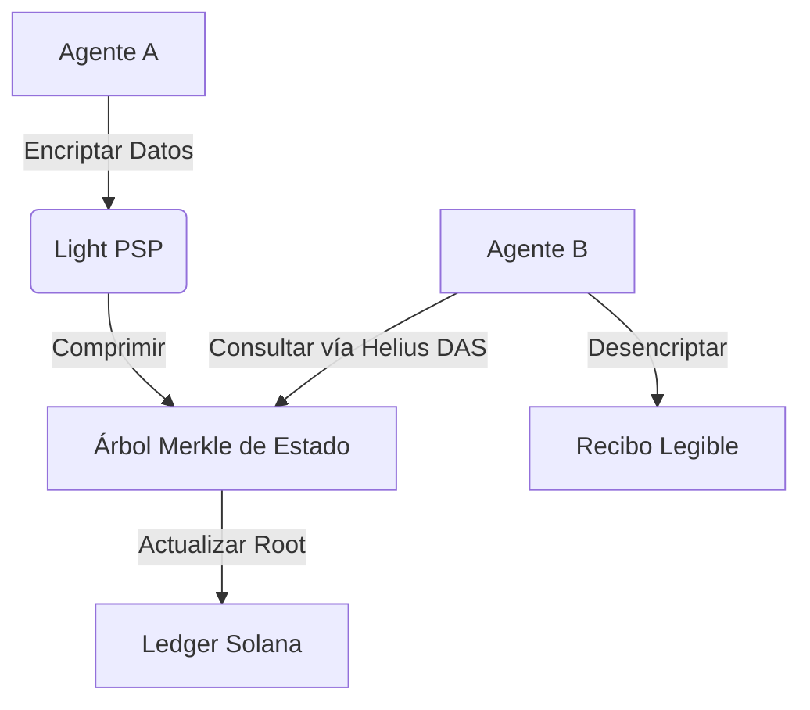

# Integración con Light Protocol

**Estado:** 
**Rol:** Estado Privado y Compresión

Light Protocol es la columna vertebral de la privacidad y escalabilidad de xB77. Proporciona la **Máquina de Estado Privado (PSP)** en Solana, permitiendo balances protegidos y almacenamiento comprimido para datos de alto volumen como recibos y catálogos de comerciantes.

## Casos de Uso

### 1. Recibos Encriptados (M2M)
Cada transacción entre agentes genera un "Recibo". Almacenar estos como cuentas estándar de Solana sería prohibitivamente costoso y público. Light Protocol nos permite almacenarlos como **Estado Comprimido**, encriptado con la clave de visualización del destinatario.

- **Costo:** ~0.000005 SOL por recibo (vs ~0.002 SOL para cuentas exentas de alquiler).
- **Privacidad:** Solo el titular de la Viewing Key puede desencriptar los detalles del recibo.

### 2. Catálogos de Comerciantes
Los comerciantes listan miles de artículos. Light Protocol permite **NFTs Comprimidos** o estructuras de datos para representar estos catálogos en la cadena sin inflar el estado, haciendo viable económicamente la "Economía de las Máquinas".

## Arquitectura



## Implementación
El programa `xb77_receipts` interactúa con el CPI de Light para acuñar estado comprimido.

```rust
// onchain/programs/xb77_receipts/src/lib.rs
pub fn emit_receipt(ctx: Context<EmitReceipt>, data: ReceiptData) -> Result<()> {
    light_cpi::create_compressed_account(
        ctx.accounts.light_program.to_account_info(),
        &data.encrypt(ctx.accounts.recipient.key),
    )?;
    Ok(())
}
```
