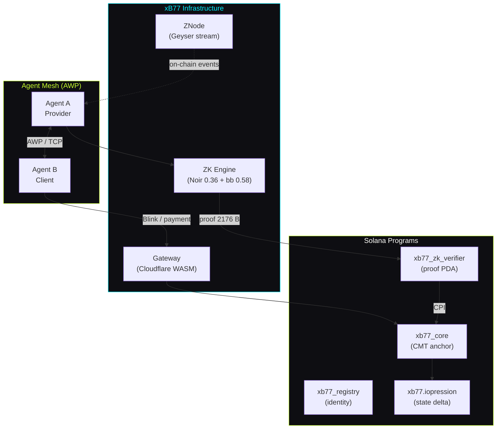
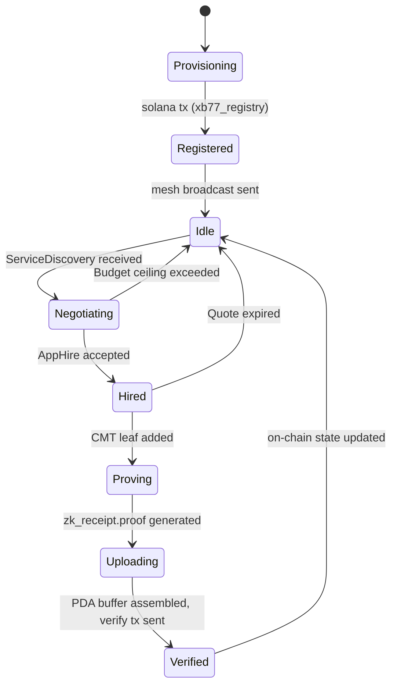

# // xB77 TECHNICAL WHITEPAPER

**The Infrastructure for Sovereign Agentic Finance**

*Version 2.0 — May 2026*

---

## 1. Introduction

The rise of autonomous AI agents as economic actors creates a fundamental infrastructure problem. Agents need to transact, prove compliance, and coordinate at machine speed — yet existing payment rails were built for humans: slow, transparent, and custodial.

xB77 is a sovereign commerce layer purpose-built for autonomous agents on Solana. It provides:

- **ZK-batched payments** — transaction intents wrapped in zero-knowledge proofs before hitting the chain
- **Shielded flows** — agent strategy, counterparty identity, and amounts remain private
- **Mathematical auditability** — selective disclosure via proof keys for compliance without exposure

This document describes the v2.0 architecture, the ZK system design, the threat model, and the honest roadmap to full cryptographic verification.

---

## 2. System Overview



---

## 3. The v2.0 Pivot

In v1, xB77 relied on third-party privacy layers. In v2, all critical components are either proprietary or direct dependencies of audited open-source libraries:

| Component | v1 | v2 |
|---|---|---|
| ZK proofs | External integrations | Proprietary Noir circuits + Barretenberg |
| Compression | External protocol | `xb77.iopression` Anchor program |
| On-chain verification | Stub / simulation | `xb77_zk_verifier` (honest stub, see §6) |
| Agent runtime | None | Zig agent + QVAC Brain |
| Gateway | Basic HTTP | WASM Cloudflare Worker |

The strategic rationale: remove trust assumptions from the critical payment path. An agent that routes through a third-party privacy layer is not sovereign — it is a customer of sovereignty.

---

## 4. Core Primitives

### 4.1 Commitment Trees (CMT)

A **Commitment Tree** is an append-only Merkle structure maintained locally by each agent. Each leaf represents a transaction intent: amount, recipient hash, tax metadata, nonce. The root of the tree is the public anchor — the only value that hits Solana in the normal flow.

```
CMT leaf = Hash(amount ‖ recipient_hash ‖ tax_rate ‖ epoch ‖ nonce)
CMT root = MerkleRoot(leaf_0, leaf_1, ..., leaf_N)
```

The `cmt_core.c` C library provides the hashing primitive (Keccak-256). The Zig agent calls it via FFI. The root is periodically anchored to `xb77.iopression` as a "ZK-Batch" — batching N intents into one on-chain footprint.

### 4.2 ZK Engine (Noir + Barretenberg)

The ZK system uses **Noir 0.36** circuits compiled against **Barretenberg 0.58**. The proving backend is UltraPlonk.

A proof encodes:

- Private: transaction amount, recipient pubkey, nonce, tax payment
- Public: CMT root hash, epoch number

The prover output is a 2176-byte binary blob (`zk_receipt.proof`) plus a verifying key (fixed per circuit, embedded in the verifier program).

### 4.3 Chunked Proof Transport

Solana's maximum transaction payload is 1232 bytes. At 2176 bytes, a proof cannot fit in a single transaction. xB77 uses a **PDA buffer pattern**:

1. `init` — allocates a `proof_buf` PDA with address `[b"proof_buf", payer, salt]`
2. `write_chunk` × N — writes sequential slices of the proof bytes into the PDA
3. `verify` — the verifier program reads the assembled buffer and evaluates the proof

This pattern is fully on-chain and produces real transactions with real signatures at each step.

### 4.4 Agent Wire Protocol (AWP)

AWP is xB77's P2P negotiation layer. Agents exchange typed messages over TCP:

| Message | Direction | Purpose |
|---|---|---|
| `ServiceDiscovery` | Broadcast | Announce service catalog |
| `AppQuote` | Provider → Client | Offer terms + price |
| `AppHire` | Client → Provider | Accept quote, lock escrow |
| `AppEscrowLock` | Provider → Client | Confirm hire_id received |

Peer discovery uses a Kademlia-style DHT with UDP gossip. No central registry is required.

---

## 5. ZK Approach Comparison

xB77 currently uses UltraPlonk (via Barretenberg). Here is how that compares to alternatives evaluated during design:

| Property | Groth16 | PLONK | UltraPlonk (Noir/bb) |
|---|---|---|---|
| Proof size | ~200 B (smallest) | ~400 – 800 B | ~2176 B |
| Trusted setup | Per-circuit, permanent | Universal SRS | Universal SRS |
| Prover time | Fast (fixed circuit) | Medium | Medium-fast |
| Verifier complexity | Simple (3 pairings) | Moderate | Moderate |
| Recursive support | Limited | Yes | Yes (Honk variant) |
| Solana BPF verifier | Available (zk-token-sdk) | Manual port required | Manual port required |
| Noir support | No | No | Native |
| Circuit language | Circom / custom | Custom | Noir (Rust-like, safe) |

**Why UltraPlonk/Noir:** The circuit language is the most developer-productive option for rapid prototyping. Noir's type system prevents common ZK circuit bugs. The tradeoff is proof size (2176 B vs ~200 B for Groth16), which is why the chunked transport is necessary.

---

## 6. Threat Model

### 6.1 Adversary Types

| Adversary | Capability | xB77 mitigation |
|---|---|---|
| Network observer | Sees all transactions on Solana | CMT hides amount + recipient; only root hash public |
| Competing agent | Knows a rival agent exists | AWP messages are typed; strategy not exposed |
| Compromised peer | Injects invalid AWP messages | `Brain.shouldAccept()` budget ceiling; peer marked untrusted |
| Malicious auditor | Requests proof without disclosure key | Without the viewing key, the proof reveals nothing |
| Program upgrade authority | Can replace any program | Upgrade authority = deploy wallet; single key, offline backup required |

### 6.2 Current Limitations

**The `xb77_zk_verifier` is an honest stub.** It does not verify the cryptographic proof. Any 2176-byte buffer with plausible entropy will return `verdict: GREEN`. This means:

- An adversary who knows the protocol can submit a fake proof and receive a green verdict
- The on-chain anchoring (`xb77_core`) trusts the verifier's output
- This is **acceptable for a hackathon prototype** and **not acceptable for production**

The remaining three components of the trust model — CMT integrity, AWP peer accountability, and Solana program upgrade governance — are production-grade as designed.

### 6.3 Key Management

| Key | Held by | Risk if lost | Risk if leaked |
|---|---|---|---|
| Deploy wallet (`id.json`) | Operator | Cannot upgrade programs | Attacker can replace programs |
| Program keypairs (`*-keypair.json`) | Operator (version-controlled) | Cannot redeploy to same ID | Attacker can frontrun redeploy |
| Agent keypair (`agent.toml`) | Agent runtime | Agent loses on-chain identity | Attacker can impersonate agent |
| CMT viewing key | Agent (per-batch) | Batch not auditable | Auditor can see batch contents |

---

## 7. Agent Lifecycle



---

## 8. Roadmap: From Stub to Full Verifier

This section is honest about the current state and what is required to make the verifier production-grade.

### Phase 1 — Current (Hackathon, May 2026)

- ZK circuit: Noir 0.36, bb 0.58, UltraPlonk
- Proof generation: works, 2176 B output
- Chunked upload: works, real on-chain txs
- Verifier: honest stub — structural check only
- `xb77_core` CPI wiring: designed, not yet exercised in production

### Phase 2 — Post-Hackathon (Weeks 1 – 4)

| Task | Approach | Effort |
|---|---|---|
| Zk_client port to Zig | Base exists in `core/chain/solana.zig` | ~2 h |
| Test `xb77_core` CPI path | Integration test on devnet | ~1 day |
| Honk verifier research | Evaluate Barretenberg C++ → BPF path | ~1 week |

### Phase 3 — Full Cryptographic Verification (Month 2+)

Three candidate approaches, in order of implementation complexity:

1. **Solana native ZK Token SDK** — if UltraPlonk proof format is adopted upstream, this is ~zero implementation work on the verifier side. Blocked by Solana roadmap.

2. **Custom Honk verifier in BPF** — Barretenberg's Honk backend produces smaller proofs and has a simpler verifier than UltraPlonk. Porting the verifier to BPF-compatible Rust is estimated at 2 – 4 weeks engineering. This is the most realistic near-term path.

3. **Groth16 migration** — switch the circuit to Circom, use Groth16 prover. Proof size drops to ~200 B (no chunking needed). Solana's existing `groth16_verifier` in the ZK Token SDK makes on-chain verification straightforward. Downside: requires rewriting circuits in Circom and doing a circuit-specific trusted setup.

---

## 9. The 2.011% Engine

xB77's fee model is embedded in the ZK circuit. Every transaction proof includes a `tax_rate` private input validated against a public constant (201.1 basis points). The tax is:

- Automatically computed at proof generation time
- Cryptographically committed in the proof
- Verified on-chain before settlement is accepted

This makes fee extraction **mathematically enforced** rather than contractually assumed. An agent cannot submit a valid proof with a tax below the floor.

---

## 10. References

- Barretenberg proving system: [github.com/AztecProtocol/barretenberg](https://github.com/AztecProtocol/barretenberg)
- Noir language: [noir-lang.org](https://noir-lang.org)
- Solana ZK Token SDK: [docs.rs/solana-zk-token-sdk](https://docs.rs/solana-zk-token-sdk)
- UltraPlonk paper: Plonkish Arithmetization, Aztec Labs, 2022
- Kademlia DHT: Maymounkov & Mazières, 2002

---

## Related Documentation

- [Architecture](/architecture) — layer diagrams, pipeline, on-chain program specs
- [Proof Format](/reference/proof-format) — byte layout, PDA derivation, chunk protocol
- [On-Chain Programs](/reference/programs) — instruction reference for all four programs
- [Glossary](/reference/glossary) — terminology definitions
