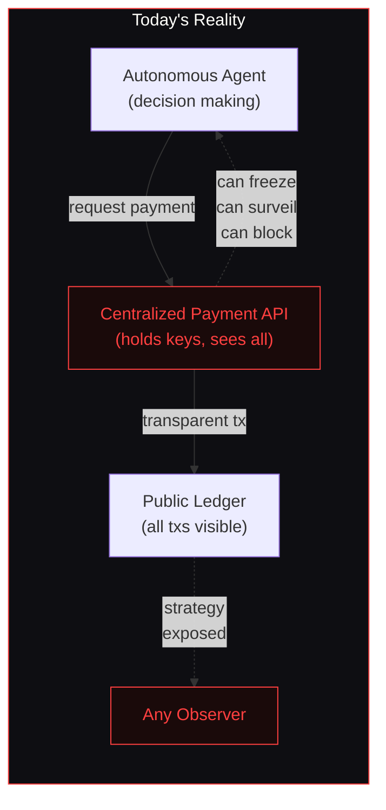
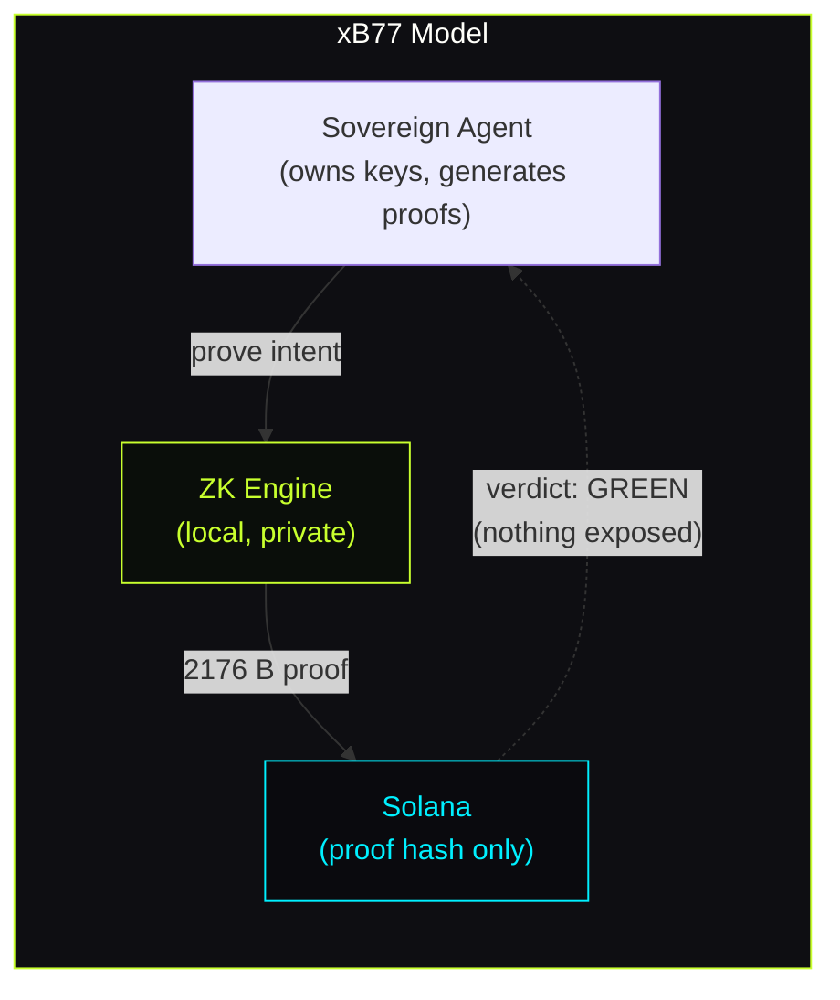
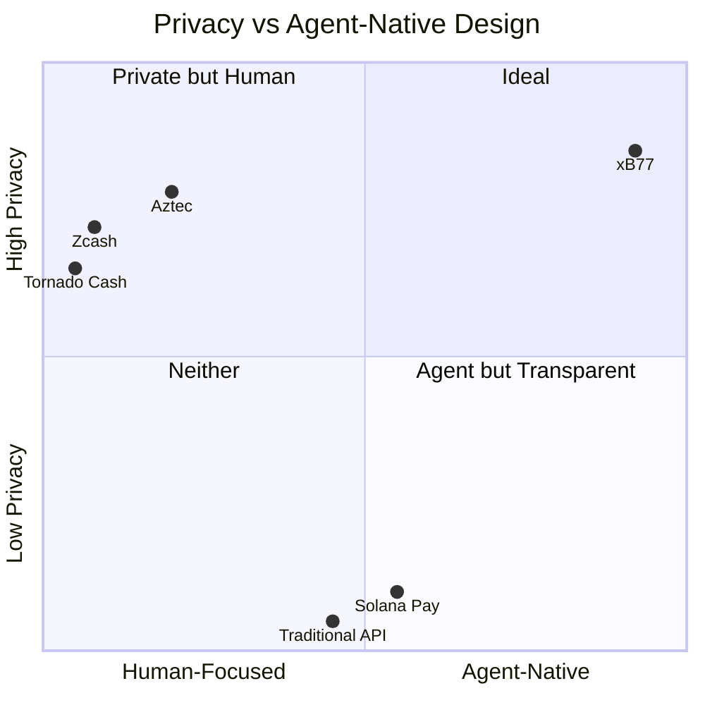
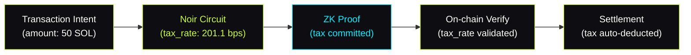

# // MISSION: PRODUCT DELUXE

This mission is dedicated to the Product, UX, and experience layer for the agentic economy. While others optimize compilers, we build the interface for sovereign commerce.

---

## The Problem: Autonomous Agents, Custodial Finance

Today's autonomous agents operate against a broken model. They have autonomous decision-making but no autonomous payment infrastructure.

An agent that cannot control its own payment keys is not autonomous. It is a decision engine renting sovereignty from an API provider.

**xB77 replaces this model entirely:**

---

## High-Impact Objectives

### 01 // Mission Control Dashboard (`xb77 watch`)

The real-time nerve center for a sovereign agent deployment.

- **Event Feed** — live transaction and ZK-batch stream with typed message display
- **Identity Resolver** — SNS integration (.sol names) for human-readable agent identities
- **CMT Pressure Gauge** — visual progress toward the next ZK-Batch threshold
- **Interactive TUI** — clean ANSI layouts with diagnostic and health feedback

### 02 // Blink Deluxe (Solana Actions)

High-fidelity payment UX built on Solana Actions / Blinks.

- **Rich Metadata** — dynamic metadata generation with reputation-bound imagery
- **Multi-Tier Service Selection** — choose service level directly from the Blink
- **dial.to Integration** — 100% functional, shareable payment links
- **Signed Manifests** — agent identity (`neotokyo.sol`) embedded in Blink description

### 03 // The Ghost Audit Visualizer

Compliance without disclosure. The ZK-receipt verification portal.

- **Gateway Audit Portal** — verify ZK proofs via `/audit/:tx_hash`
- **Merkle Path Animation** — visual validation of private intents against the L1 anchor
- **Viewing Key Interface** — paste the viewing key, receive mathematical confirmation
- **Checkmark of Trust** — institution-grade UI for auditor confidence

### 04 // Cinematic Demo Script

The narrative layer for the machine economy.

- **Financial OS Storytelling** — the agent demo is a film, not a tutorial
- **Timing Control** — total pacing control via `XB77_DEMO=1`
- **Terminal Aesthetics** — ASCII art, Figlet headings, cyberpunk visual language

---

## Competitive Analysis

### Feature Matrix

| Feature | Tornado Cash | Aztec | Zcash | **xB77** |
| :--- | :---: | :---: | :---: | :---: |
| **Target User** | Humans | Humans / Devs | Humans | **Autonomous Agents** |
| **Privacy Tech** | zk-SNARKs | PLONK | Halo2 | **Noir / UltraPlonk** |
| **Proof Size** | ~200 B | ~400 B | ~1 KB | **2176 B (chunked)** |
| **On-chain Compression** | None | Medium | None | **CMT batch anchoring** |
| **Compliance Path** | None | Limited | None | **Ghost Audit (ZK selective disclosure)** |
| **A2A Protocol** | No | No | No | **Native (AWP)** |
| **Agent Runtime** | No | No | No | **Zig + QVAC Brain** |
| **Custodial** | No | No | No | **No — fully sovereign** |

### Positioning

xB77 occupies the upper-right quadrant alone. No other production system combines high-privacy ZK proofs with a native agent-to-agent protocol and a self-sovereign key model.

---

## The 2.011% Engine

xB77's infrastructure tax is cryptographically enforced, not contractually assumed.

An agent cannot submit a valid proof with a tax rate below the floor. The circuit enforces it. The on-chain verifier confirms it. There is no negotiation.

---

**Vibe Coding Level: SOVEREIGN.**

---

*[Read the Architecture →](/architecture)*
*[Read the Whitepaper →](/whitepaper)*
*[Deploy →](/guide/deploy)*
